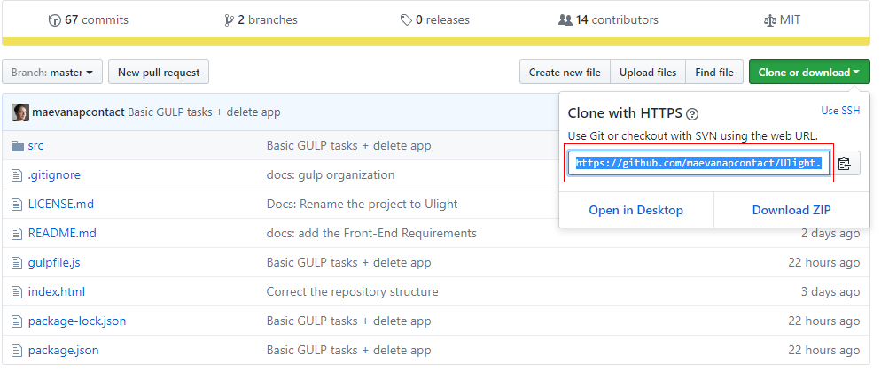

# Ulight

Welcome to the **Ulight Project**!

Here, we are making a Framework and a website for this Framework!

**Ulight** is a **CSS/ JavaScript Framework** to style original websites.

**To work with the Framework, you are in the good repository**

**To work with the website, please visit [this repository](https://github.com/maevanapcontact/Ulight-Website)**


## The Framework

Ulight allows Front-End Developer to build original websites. **It breaks the rules and the standards of the website to let the developers express their creativity!**

Ulight will propose a large library of set of designed elements that developers should use to style their own HTML files. By using classes, developers will be able to access to that library and should choose the design of their choice.

## The Website

Ulight also needs a website! To present the project and allow web designer to propose new set of designed element to integrate to the Framework.

## How can I contribute?

Ulight is an Open Source project build by a team of Recipient of the Google Developer Challenge Scholarship 2017 - 2018 for Front-End Developer path (Europe, Russia, Egypt, Israel, Turkey).

What does it mean?

It means we are all beginners and hungry to learn! If this definition suits you, welcome!

### Front-End / Integration

We need Integrators to translate the set of designed elements into code to integrate them in the Framework. We will write the code to let the users pick up some classes to add in his/ her HTML file for using original designs in their own website. We also need Front-End developers to build the core of the Framework and the website. Let's build a light and efficient Framework and an interactive website!

### Backend

The Back-End, for those who might not know what it is, is responsible for the functionality of the site including connecting to a database, handling data provided by the user and many more. The language we are going to use is PHP. Most of us are new to this language so don't hesitate to join us even if you are a beginner. The only thing we need from you is to be willing to learn! In the Trello section below you can find a link for our Trello board. You can also find me in Slack @Apostolos Ichtsis.

### UX design

The UX Design team are responsible for building a strong user experience for Ulight. If you are passionate about user experience and design, you will help contribute to the UX document which includes but not limited to challenges, user empathy, defining UX problems, ideation, design concepts, wireframes, prototyping and testing. The UX process which we will follow is: Empathise > Define > Ideate > Prototype > Test.

### UI / Webdesign

We need web designers and graphic designers of all abilities to build the template of the website and the set of designed elements that will be integrated in the Framework. We are focusing mainly on improving skills that we already have, and this will very much be a work in progress that is constantly evolving and improving over time.

### Marketing

We need markters or people that are interested in marketing to make the project in better positioning and present it to the whole community.

## Get Started

- [Install Git](https://git-scm.com/downloads)

Here are some tutorials to help you **install and use Git** ([basic commands](https://try.github.io/levels/1/challenges/1), [full tutorial](https://www.slideshare.net/IslamSayed18/github-tutorial-83175509))
- **Fork** the project (Here is a [tutorial about Fork](https://help.github.com/articles/fork-a-repo/))
- **Create a new folder** in your computer to welcome the project from GitHub
- Open the **Git console** and navigate inside your computer, positioned yourself on the new folder you have created
- **Clone your fork** of the repository in your current folder using this command:

`git clone https://github.com/<your-github-pseudo>/Ulight.git`

You can find this link following those steps:
1. Go to your **GitHub profile**
2. Go to your **fork** of the Project
3. Press **"Clone or download"**


4. **Copy/ paste the URL** using HTTPs (Not SSH)
- Navigate inside the new folder that had been created using this command:

`cd Ulight`
- Set the **remote upstream** to the original repository using this command:

`git remote add upstream https://github.com/maevanapcontact/Ulight.git`
- Be sure to be **up-to-date** with your version of the repository with those commands:

```
git checkout ulight-dev
git pull upstream ulight-dev
```

For more information about remotes check [this tutorial](https://help.github.com/articles/adding-a-remote/)


- Create a **new branch** to make your own changes, check those [Udacity Guidelines Git](https://udacity.github.io/git-styleguide/) to know how to create good commits name.

`git checkout -b name-of-your-branch`
- It is the time to open your text editor and to start working on your changes!

When you are ready to submit your work, then continue.
- Locally **rebase the upstream branch** into the branch you have created to do your changes by using this command:

`git pull --rebase upstream ulight-dev`
- **Push your work** (on your new branch) in your own fork of the project using this command:

`git push origin name-of-your-branch`
- Open a **Pull Request** to submit your work. Be sure to propose it into the branch ulight-dev.

Here is a [tutorial about Pull Requests](https://help.github.com/articles/creating-a-pull-request/)

### Learn and work
In this project we are using few technologies and software to help us achieve the work. You can easily learn about those by taking a look to the tutorials.

- [HTML](https://www.w3schools.com/html/) and [CSS](https://www.w3schools.com/css/default.asp) for Front-End and integration
- [JavaScript](https://www.w3schools.com/js/default.asp) for webpage interaction
- [SASS](http://sass-lang.com/guide) with the scss syntax (closer to the pure CSS)
- [Normalize.css](https://necolas.github.io/normalize.css/)
- [Gulp](https://gulpjs.com/)
- [PHP](https://www.w3schools.com/php/)
- [MySQL](http://www.mysqltutorial.org/)

### Trello
You will find all **tasks** to do in those trello boards. Once you've decided what you want to do, contact the lead of the field and ask him to assign you the task.
- [UX Design Trello Board](https://trello.com/b/rc1sScmS/ux-design)
- [Backend Trello Board](https://trello.com/b/0UGED8ew/backend)
- [UI/ Web design Trello Board](https://trello.com/b/ODKM9jhg/graphic-design)
- [Front-End Trello Board](https://trello.com/b/dc21HkUj/front-end)
- [Marketing Trello Board](https://trello.com/b/6qyC7P5z/marketing)

## Requirements to start working
### Front-End part

We work with [GULP](https://gulpjs.com/) that is a task manager. It is here to help us automate some repetitive tasks and to normalize our work.

To be able to work efficiently in this project, you will need GULP. So download it and learn it enough to contribute to the project.

Here are some tutorials to help you in your journey:
- https://www.youtube.com/watch?v=1rw9MfIleEg
- https://www.youtube.com/watch?v=LmdT2zhFmn4&list=PLv1YUP7gO_viROuRcGsDCNM-FUVgMYb_G
- https://github.com/gulpjs/gulp/blob/master/docs/getting-started.md

To start working, you will need to install [Node.js](https://nodejs.org/en/) and to download locally those GULP packages
- [SASS](https://www.npmjs.com/package/gulp-sass)
- [ImageMin](https://github.com/sindresorhus/gulp-imagemin) - for the website only

**Don't forget that we have 2 repositories!!**

One for the Framework (this current one) and one for the [Website](https://github.com/maevanapcontact/Ulight-Website)

So you will need to install GULP locally 2 times (except if you wish to work only on one project).

## Contact
### Slack
If you are from the Udacity Front-End Developer path, you can join the channel #ulight on Slack

### Leads
- Sarah F (Management)
- Asher (UX Design)
- Apostolos Ichtsis (Backend)
- JABedford (UI/Web design)
- Maeva NAP (Front-End)
- Gehad (Marketing)
